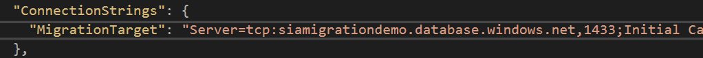

# Contributing

See the [Root repository](https://github.com/azure/Sia-Root) for full project information and an overview of how services fit together.

This project welcomes contributions and suggestions.  Most contributions require you to agree to a
Contributor License Agreement (CLA) declaring that you have the right to, and actually do, grant us
the rights to use your contribution. For details, visit https://cla.microsoft.com.

When you submit a pull request, a CLA-bot will automatically determine whether you need to provide
a CLA and decorate the PR appropriately (e.g., label, comment). Simply follow the instructions
provided by the bot. You will only need to do this once across all repos using our CLA.

General contribution guidelines are in the [SIA-Root HOWTOCONTRIBUTE.md](https://github.com/Azure/Sia-Root/blob/master/HOWTOCONTRIBUTE.md)

This project has adopted the [Microsoft Open Source Code of Conduct](https://opensource.microsoft.com/codeofconduct/).
For more information see the [Code of Conduct FAQ](https://opensource.microsoft.com/codeofconduct/faq/) or
contact [opencode@microsoft.com](mailto:opencode@microsoft.com) with any additional questions or comments.

# Cloning this repository

This repository has the https://github.com/Azure/Sia-Root git repository embedded as a submodule.
Once you've cloned this repository, use your git client to navigate to "domain" subdirectory, and run

```
git submodule init
git submodule update
```
This will clone the submodule repository. For more information on submodules, see [the Git Tools Documentation for Submodules](https://git-scm.com/book/en/v2/Git-Tools-Submodules)


# Setting Up Your Development Environment

## Service Architecture


This Gateway is intended to be extended by Sia microservices in other 
repositories. You should launch the services before launching the Gateway: 

In order to test functionality of the gateway on your local machine:
1. For each `Service` in `appsettings.Development.json`:
	1. Clone the associated repository (Example: Incident is associated with the SiaManagement repository)
	2. Change the default startup from the project name to `IIS Express` and start
	3. You will need to have a separate visual studio instance open for each service the gateway will interact with.
	   (If you find a good way to do this without having visual studio open, please let the maintainers of this project know)
	4. Validate that the localhost port the service is running on matches its configuration in `appsettings.Development.json`.
		You can find IIS Express information by right clicking the IIS Express icon in your system tray.
2. Get appropriate Secrets for authentication
	1. Right click on the Sia.Gateway project and select "Manage user secrets"
	2. Use `usersecrets.template.json` as a template for your usersecrets json file
	3. You will need these configuration values fom:
		1. Your AAD instance (the default is correct for the vast majority of scenarios)
		2. Your AAD tenant
		3. Your Key Vault vault name
		4. Your ApplicationInsights instrumentation key name
		5. The secret that is used to authenticate to azure key vault for the gateway (`ClientSecret`)
			* This secret can be found in the azure portal in the AAD App Registration for your Gateway instance
3. Launch the Gateway (in Visual Studio: ensure that the startup project is set to `Sia.Gateway` and the profile is set to `IIS Express`)

# Setting up the database

Note: More comprehensive documentation of Entity Framework Database Migrations is available [here](https://docs.microsoft.com/en-us/aspnet/core/data/ef-mvc/migrations).

1. Set up an empty SQL server database (this can be baremetal, Azure SQL, or any service that will provide a connection string)
2. Add the connection string from the empty database to user secrets or environment variables as `ConnectionStrings:MigrationTarget`
	
3. Ensure the user in your connection string has ownership of the database you're updating.
4. If you have not already done so, restore nuget packages for the solution
5. Set the Default project to the project containing the DbContext class for the database you want to initialize or update
6 From the Visual Studio Package Manager Console, navigate to the directory containing the .csproj file for the project you set in the previous step
	`cd ./src/Sia.Gateway/`
7. Ensure that the latest versions of Microsoft.EntityFrameworkCore.Tools and Microsoft.EntityFrameworkCore.Tools.DotNet are added as DotNetCliToolReferences in the .csproj file.
	* See Sia.Data.Incidents.csproj as an example
8. Enter the command:
	`dotnet ef database update`
	Success looks like: 
9. Troubleshoot any errors using these resources (and add any new resources that solve a problem you encounter):
	* [Microsoft.NETCore.App version X was not found](http://www.hanselman.com/blog/TheMysteryOfDotnetWatchAndMicrosoftNETCoreAppVersion110preview100110000WasNotFound.aspx)
	* [Specified Framework Version 'X.X' could not be parsed](https://developercommunity.visualstudio.com/content/problem/150697/the-specified-framework-version-20-could-not-be-pa.html)
10. Use SQL Server Object Explorer, Visual Studio, or another SQL client to validate that tables have correctly added.
	

# Ticketing System Connectors

Sia can be configured to to work with a separate ticketing system,
either by leveraging a proxy API or by direct access with a custom connector.

Data from connected ticketing systems can be used to generate events and/or present
additional information and context on the UI.

Sia will still function without a connected ticketing system, and will persist limited
ticket data in the Incident database (see Sia.Data.Incident\Models\Ticket.cs)

For additional information on using, configuring, and creating ticketing system
connectors, see README.md in [src\Sia.Connectors.Tickets](/tree/master/src/Sia.Connectors.Tickets)